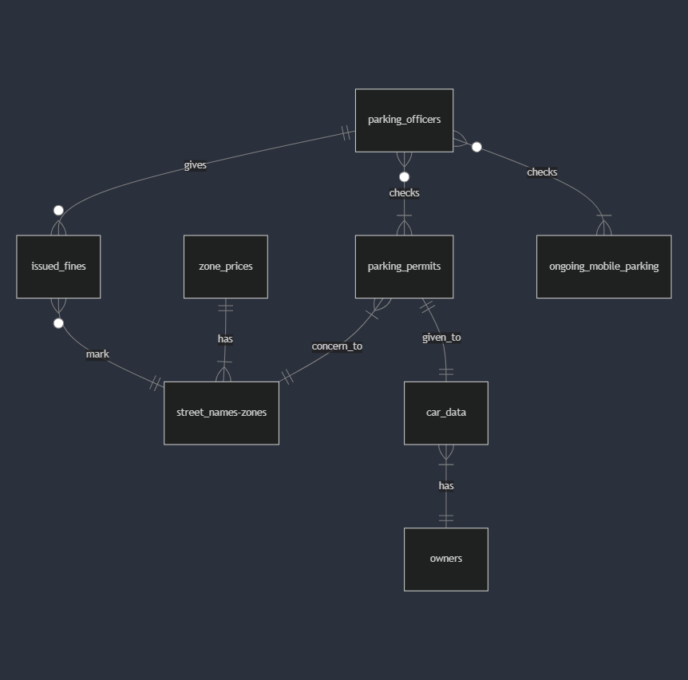

# District Parking Database 

## Scope
The purpose of the database is to cover a demo parking system within a city district.

**This includes:**

- Data about owners, cars, and parking permits.
- The streets of the district, which zones they belong to, and the pricing of the zones.
- Providing the ability to start, check and stop mobile parking.
- Simplified data of parking officers.
- Storing parking fines issued by parking officers for unauthorized cars.

**Usage:**

1. Start SQLite3 with the name xy.db.
2. .read schema.sql
3. .read test_data.sql - adds some test data
4. PRAGMA foreign_keys = 1; - this enables the foreign key constraint which is important for data integrity, mostly in parking permits.
5. From that point, you can test the commands & queries in queries.sql.

## Functional Requirements
The basic functionalities and default queries available after setting up the database in SQLite3, no other add-ons needed.

**The database capabilities:**

- Adding/deleting owners, where one owner can have multiple cars.
- Adding/deleting cars and permits.
    - If an owner has multiple cars, it is possible to delete the permit from the database while keeping the owner's data intact.
    - Retrieving all data of the owner and the car in a connected manner.
    - Check the number of permits issued per zone.

- Adding the street database of a district, assigning zones, and setting zone-related pricing.
- Starting, checking, and stopping mobile parking.
- Adding/deleting the parking staff.
- Issuing fines by parking officers, requiring only the car's license plate and street name.
    - You need the streets with zone_id to be available in the database otherwise it won't work.
    - Before issuing a parking fine, the officer can check if a car has a district permit or if there is an active mobile parking session for the given zone, which checks both tables instantly.
    - It is possible to query whether a given license plate has already received a parking fine on the same day to avoid double charging.
- Paying fines based on the license plate and fine ID.

**You can check:**

- Unpaid parking fines individually and by count.
- Fines issued between 'YYYY-MM-DD' AND 'YYYY-MM-DD' individually and by count.
- Fines issued by parking officers individually and by count.
- A separate CREATE VIEW table for the number of unpaid fines issued for the month.
- A separate CREATE VIEW table for the total collected surcharge payment for the current month.

**Works automatically (customizable):**

- Start time and expiration time of mobile parking (default 3-hour period).
- Automatic addition of hourly parking fees based on street > zone.
- Automatic calculation of parking fines based on street > zone (default *10).
- Setting the payment deadline for parking fines (default +14 days).

**Limitations:**

- Due to SQLite3 limitations, automatic parking ticket deletion is solved by checking for expired parking tickets and deleting them when someone starts a new parking session.
- The license plate format is not specified as it can vary. A default check can be added with the command "CHECK ("plate_number" GLOB '[A-Z][A-Z][A-Z]-[0-9][0-9][0-9]')". Business logic and data validation should be implemented in the management software rather than the database.
- The database does not provide protection against double charging if a car has a valid permit; this decision is up to the parking officer whether to issue a parking fine.

## Representation

### Entities

**"owners":**

"id" INTEGER,\
"first_name" TEXT NOT NULL,\
"last_name" TEXT NOT NULL,\
"company_name" TEXT DEFAULT NULL,\
"street" TEXT NOT NULL,\
"apartment_number" INTEGER DEFAULT NULL,\
"floor" INTEGER DEFAULT NULL,\
"door" INTEGER DEFAULT NULL,\
"phone" TEXT NOT NULL,\
"email" TEXT UNIQUE NOT NULL,\
PRIMARY KEY ("id")

- In the owners table, it is crucial to know which owner lives on which street (verifiably) to ensure that only district residents receive parking permits in real life. Their phone number and email address also help in identification. (Optionally, a date of birth can be added. - Need to refine the addition process in queries.sql)
- The apartment number is not necessarily required, but it depends on the district what data they request.
- Not every owner has their own company, but every company has its own owner.

\
\
**"car_data":**\
"plate_number" TEXT,\
"owner_id" INTEGER NOT NULL,\
"manufacturer" TEXT NOT NULL,\
"weight" INTEGER CHECK("weight" < 9999 AND WEIGHT > 0) NOT NULL,\
PRIMARY KEY ("plate_number"),\
FOREIGN KEY ("owner_id") REFERENCES "owners"("id") ON DELETE CASCADE\

- To avoid problematic cases and fake license plate permits, it is good to have the car type and weight recorded for identification based on the vehicle registration.
- The weight constraint can be optionally set if, for example, no permits are issued for trucks, and to avoid data entry errors (e.g., 1350 > 13500).
- The car_data."owner_id" references the "owners".("id"), and if an owner is deleted, the vehicle data is also deleted since a car cannot exist in the database without an owner.
- ❗PRAGMA foreign_keys = 1;❗ needed at every SQLite3 database start to enable foreign key constraints to maintain data integrity.

\
\
**"parking_permits"**\
"id" INTEGER,\
"plate_number" TEXT UNIQUE NOT NULL,\
"permit_type" TEXT CHECK(permit_type IN ('residental', 'business')) NOT NULL,\
"zone_id" INTEGER NOT NULL,\
"start_date" DATE,\
"end_date" DATE,\
PRIMARY KEY ("id"),\
FOREIGN KEY ("plate_number") REFERENCES "car_data"("plate_number") ON DELETE CASCADE

- The license plate is unique, so it cannot be added twice, helping to maintain data integrity.
- Two types of permits can be issued: residential and business. An owner can have both types of permits.
- The zone_id is manually added by customer service based on the street requested by the owner, so it does not directly reference street_names.
- "start_date" and "end_date" are in DATE format because it is not necessary to know the exact validity of a permit down to the minute, as these are usually issued for one year.
- The parking_permits."plate_number" references "car_data"("plate_number"), so **if we want to delete a car's permit, you must delete it by license plate from "car_data" (! This does not delete the owner's data; if we want to delete all data related to a car and owner, it is better to delete the owner, which will delete all related data (cars and their permits!)).**
- ❗PRAGMA foreign_keys = 1;❗ needed at every SQLite3 database start to enable foreign key constraints to maintain data integrity.

\
\
**"street_names"**\
"id" INTEGER,\
"street" TEXT UNIQUE,\
"zone_id" INTEGER NOT NULL,\
PRIMARY KEY ("id")

- In this design and setup, a street can only belong to one zone.
- If ("street" TEXT UNIQUE) > ("street" TEXT), it cannot be changed even if zone boundaries are needed, as this would require adding street numbers, which would require a complete overhaul of the database.
- The table is currently used to provide zones based on street names for parking officer permit queries, mobile parking, and fines.

\
\
**"zone_prices"**\
"zone_id" INTEGER,\
"parking_price" REAL NOT NULL,\
PRIMARY KEY ("zone_id"),\
FOREIGN KEY ("zone_id") REFERENCES "street_names"("zone_id")

- Each zone has a specified price, which can be freely modified and is modular.
- The "parking_price" cannot be NULL as it is needed for mobile parking fees and parking fine calculations.
- The "parking_price" can be an INTEGER depending on the currency.
- The zone_prices."zone_id" references "street_names"("zone_id"), so if all zone_ids are deleted that are not linked to any street, the zone price is also deleted from the "zone_prices" table.

\
\
**"parking_officers"**\
"id" INTEGER,\
"first_name" TEXT NOT NULL,\
"last_name" TEXT NOT NULL,\
PRIMARY KEY ("id")

- DEMO data has been provided, and parking officer data can be freely modified.

\
\
**"ongoing_mobile_parking"**\
"id" INTEGER,\
"plate_number" TEXT NOT NULL,\
"permit_type" TEXT,\
"zone_id" INTEGER NOT NULL,\
"hourly_price" REAL,\
"start_date" DATETIME,\
"end_date" DATETIME,\
PRIMARY KEY ("id"),\
FOREIGN KEY ("zone_id") REFERENCES "zone_prices"("zone_id")

- Permit_type is automatically added by a trigger named 'mobile parking', it's important to show when a parking officer checks the car and sees what kind of permit the car has.
- The mobile parking columns have a similar structure to "parking_permits", making it easier to query important data and perform UNION operations.
- To start mobile parking, you only need the license plate and street name and it automatically adds the zone_id of the street.
- permit_type, zone_id, hourly_price, start_date, end_date are automatically added.
- The "start_date" and "end_date" fields are in DATETIME here, unlike the DATE in "parking_permit", because we are purchasing tickets for 3-hour periods, but the database can still handle queries this way.

\
\
**"issued_fines"**\
"id" INTEGER,\
"officer_id" INTEGER NOT NULL,\
"plate_number" TEXT NOT NULL,\
"fine_date" DATETIME,\
"street_name" TEXT NOT NULL,\
"payment_deadline" DATETIME,\
"already_paid" TEXT NOT NULL CHECK(already_paid IN ('YES', 'NO')) DEFAULT 'NO',\
"payment_date" DATETIME DEFAULT NULL,\
"surcharge_rate" REAL,\
PRIMARY KEY ("id"),\
FOREIGN KEY ("officer_id") REFERENCES "parking_officers"("id"),\
FOREIGN KEY ("street_name") REFERENCES "street_names"("street")

- Easily issue a parking ticket with only the parking officer's "id", license plate, and street name.
- The fine_date, payment deadline, and surcharge_rate are automatically added.
- You can also pay the fine, in which case the "already_paid" should be set to yes and the payment date should be updated.

**The database structure is contained in schema.sql.**\
**Several default queries are included in queries.sql with comments to test the basic functionalities.**

## Relationships

**Default ER Diagram**

- An "owner" can have multiple cars - a car has one owner.
- A car has one permit, and a permit belongs to one car.
- A parking permit belongs to one zone, and a zone can have multiple parking permits.
- A zone can have one unit price, and a zone unit price can belong to multiple streets.
- An issued fine marks one zone and street, and multiple parking fines can be issued in one street.
- A parking officer can check multiple parking permits, but a parking permit does not belong to any officer.
- A parking officer can check one or more mobile parking sessions, but a mobile parking session does not belong to any officer.
- A parking officer can have 0 or more fines, but a parking fine belongs to one officer.

## Optimizations

### INDEXES
I analyzed most queries with EXPLAIN QUERY, and thus the frequently queried columns received partial indexes, which significantly speeds up the database.

- CREATE INDEX "idx_parking_permits_plate_number" ON "parking_permits" ("plate_number");\
- CREATE INDEX "idx_street_names_street" ON "street_names" ("street");\
- CREATE INDEX "idx_ongoing_mobile_parking_plate_number" ON "ongoing_mobile_parking" ("plate_number");\
- CREATE INDEX "idx_issued_fines_plate_number" ON "issued_fines" ("plate_number");\
- CREATE INDEX "idx_issued_fines_officer_id" ON "issued_fines" ("officer_id");\
- CREATE INDEX "idx_issued_fines_fine_date" ON "issued_fines" ("fine_date");\
- CREATE INDEX "idx_issued_fines_payment_date" ON "issued_fines" ("payment_date");\
- CREATE INDEX "idx_issued_fines_car_data" ON "car_data" ("owner_id");\
- CREATE INDEX "idx_ongoing_mobile_parking_end_date" ON "ongoing_mobile_parking"("end_date");

### VIEWS

Since the database is dynamic and specific in many parts, I added VIEWs to collect the most frequently used useful data. Feel free to add more when you feel the need.

**Number of unpaid parking issues for this month**\
CREATE VIEW "unpaid_parking_issues_this_month" AS\
SELECT COUNT("already_paid") AS "Waiting for payment" FROM "issued_fines"\
WHERE "already_paid" = 'NO'\
AND "fine_date" BETWEEN DATETIME('now', 'start of month') AND DATETIME('now', 'start of month', '+1 month', '-1 second');

**Total collected surcharge payment for the actual month**\
CREATE VIEW "parking_fines_sum_for_this_month" AS\
SELECT SUM("surcharge_rate") AS "Total amount paid" FROM "issued_fines"\
WHERE "already_paid" = 'YES' AND "payment_date" BETWEEN DATETIME('now', 'start of month') AND DATETIME('now', 'start of month', '+1 month', '-1 second');

### TRIGGERS
I added some **default triggers which are needed for the database to functionate well!**

- CREATE TRIGGER "calculate_surcharge_rate_and_fine_date_deadline"
    - Automatically add surcharge price, fine date and the payment's deadline to issued fines.
    - You can modify the deadline as you will, default is 14 days "DATETIME('now', '+14 days')".
    - You can modify the surcharge rate by changing > | "parking_price" * 10 | > 10 is the modifier. Means 10 times the actual zone price where you can get the issued fine.

- CREATE TRIGGER "set_parking_dates_prices"
    - Adds a start and end date to a started mobile parking & automatic hourly price based on which zone the car in parks.
    - You can modify the maximum park time lenght which default is 3 hours "end_date" = DATETIME('now', '+3 hours')".
    - Hourly price calculated based on zone_id > zone_price. When you start a mobile parking you need the street which gives back the zone. When you want a GPS based zone_id the business logic should be implemented in the application management layer.

- CREATE TRIGGER "delete_expired_tickets" - OPTIONAL
    - After a new mobile parking has been started. It deletes the expired mobile parkings permits. Could be better with "EVENT" keyword in mysql.

## Limitations
- PRAGMA foreign_keys = 1; needed at every SQLite3 database start to enable foreign key constraints to maintain data integrity.
- In this design and setup, a street can only belong to one zone.
- ! If ("street" TEXT UNIQUE) > ("street" TEXT), it cannot be changed even if zone boundaries are needed, as this would require adding street numbers, which would require a complete overhaul of the database.
- Due to SQLite3 limitations, automatic parking ticket deletion is solved by checking for expired parking tickets and deleting them when someone starts a new parking session.
- The license plate format is not specified as it can vary. A default check can be added with the command "CHECK ("plate_number" GLOB '[A-Z][A-Z][A-Z]-[0-9][0-9][0-9]')". Business logic and data validation should be implemented in the management software rather than the database.
- The database does not provide protection against double charging if a car has a valid permit; this decision is up to the parking officer whether to issue a parking fine.
